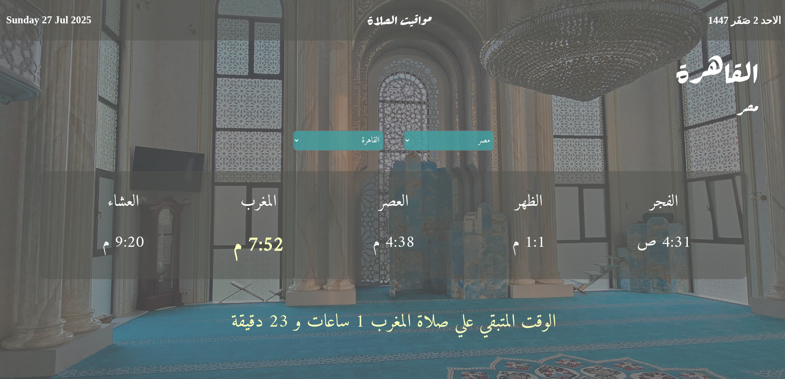
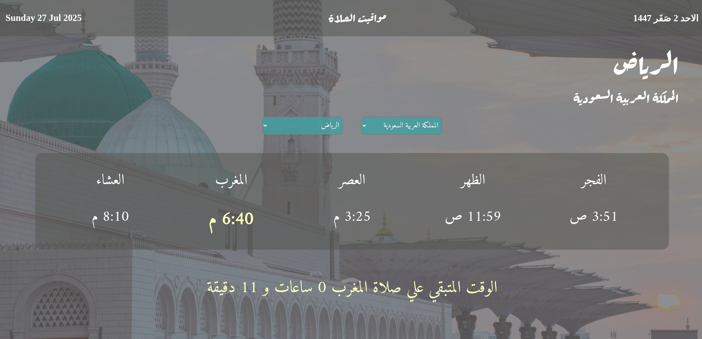
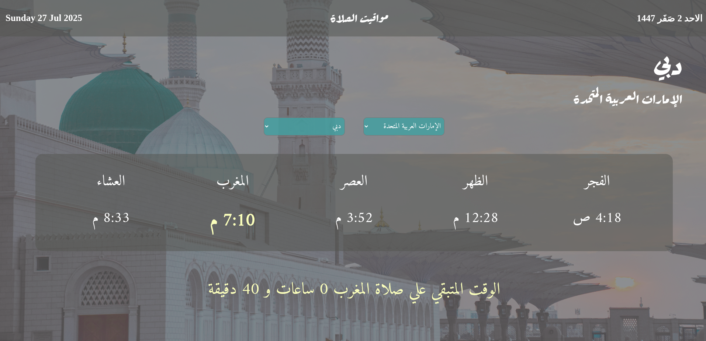

# 🕌 Prayer Times Web App

A responsive Arabic web app that displays Islamic prayer times based on selected country and city. Includes real-time countdown to the next prayer, Gregorian and Hijri dates, and plays the Adhan automatically.

---

## 🌟 Features

- 🌍 Supports major cities in:
  - **Egypt 🇪🇬**
  - **Saudi Arabia 🇸🇦**
  - **United Arab Emirates 🇦🇪**
- 📅 Displays both **Gregorian** and **Hijri** dates.
- 🕰️ Live countdown to the next prayer.
- 🔊 Plays **Adhan (Athan)** audio at prayer time.
- 🎨 Background image slider with smooth animation.
- 📱 Fully responsive design for mobile and desktop.

---

## 🚀 Live Demo

👉 [Click here to try the live version](https://your-netlify-link.netlify.app)

> Replace with your actual Netlify URL once deployed.

---

## 📸 Screenshots

### 🇪🇬 Egypt - Cairo


### 🇸🇦 Saudi Arabia - Riyadh


### 🇦🇪 UAE - Dubai


---

## 🧰 Tech Stack

- **HTML / CSS / JavaScript**
- **Axios** for API calls
- **AlAdhan API** for accurate prayer timings
- **Google Fonts** (Rakkas and Amiri)
- **Netlify** for deployment

---

## 🧠 How to Use Locally

1. Clone the repository:
   ```bash
   git clone git@github.com:ahmdamir/Prayer-Times.git
